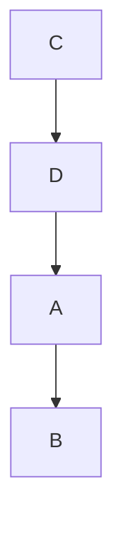
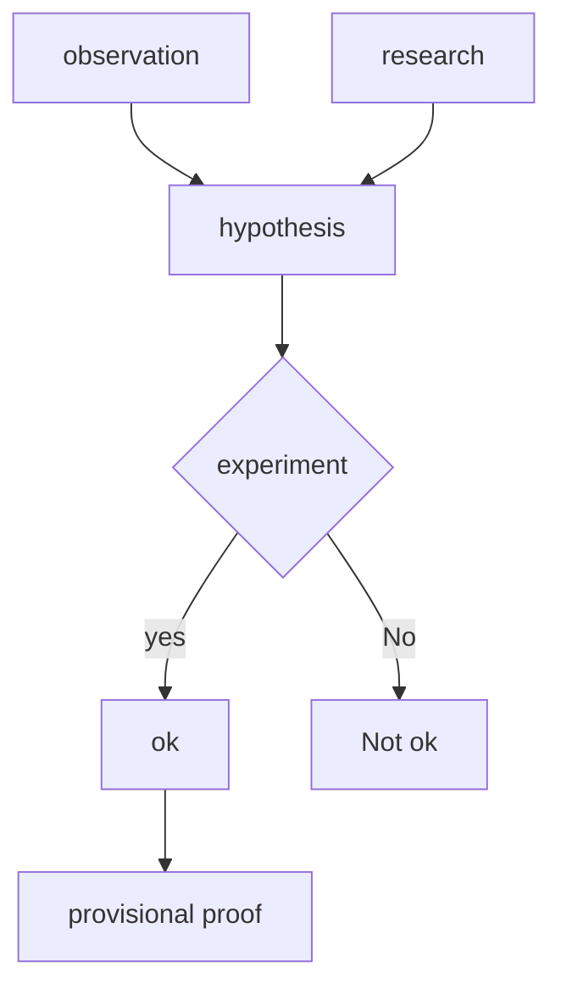

# Scientific-analysis-and-presentation
--------

## 1차 숙제 description
서울시 연평균 기온

최고기온 최저기온

미래 예측


```mermaid
  graph TD;
  A -->B;
  C -->D;
  D -->A;
```

```mermaid
  flowchart TD;
    E[observation]-->A;
    F[research]-->A;
    A[hypothesis]-->B{experiment};
    B -- yes --> C[ok];
    B -- No --> D[Not ok];
    C-->G[provisional proof]
```
```python
  def f(x):
    return(2*np.sin(x/2)*np.cos(s/2))

```
